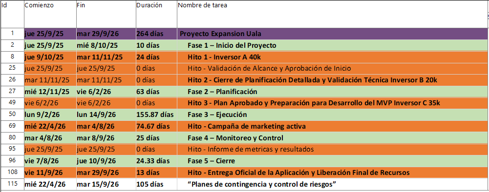

# 💳 Ualá México – Digital Project Management Case Study

Strategic project management case study focused on the expansion of a digital fintech platform targeting financial inclusion in Mexico.

This project integrates structured planning, financial modeling, stakeholder management and schedule control using professional project management methodologies and tools.

---

## 🎯 Project Objective

Design and manage the implementation of a fully digital fintech ecosystem including:

- Digital account + Mastercard card  
- Microcredit services  
- Financial education tools  
- Scalable revenue model  

The project was structured following a phase-based lifecycle approach (Initiation, Planning, Execution, Monitoring & Control, Closure).

---

## 🧩 Scope & Governance

- Work Breakdown Structure (WBS)  
- Stakeholder identification and engagement strategy  
- Scope definition and success criteria  
- Deliverables validation process  
- Phase-gate milestone approvals  

---

## 📊 Schedule Management

The project schedule was developed using **Microsoft Project** and includes:

- Phase-based structuring  
- Task dependencies and logical sequencing  
- Critical milestones  
- Baseline planning  
- Planned vs actual tracking

---

## 📁 Repository Structure
- **docs/** → Executive presentation and integrative report  
- **schedule/** → Original Microsoft Project planning file  
- **assets/** → Visual resources used in the README  

### Executive Gantt Overview

The repository includes the original `.mpp` file and an executive visualization of the Gantt diagram.

---

## 💰 Cost & Budget Control

- Baseline budget definition  
- Cost tracking and variance analysis  
- Budget adjustment justification  
- Financial deviation assessment  

---

## ⚠️ Risk Management

- Risk identification matrix  
- Probability-impact evaluation  
- Mitigation strategies  
- Contingency planning  
- Residual risk assessment  

---

## 🛠️ Tools Used

- Microsoft Project  
- Financial planning models  
- Risk matrix frameworks  
- Business Model Canvas  
- Executive reporting (PowerPoint)  

---

## 🧠 Competencies Demonstrated

- Digital project planning  
- Fintech strategic modeling  
- Budget and schedule control  
- Stakeholder governance  
- Risk management  
- Executive-level communication  

---

## 🎓 Academic Context

Developed as part of the course **Taller: Gestión de Proyectos Digitales**  
Universidad de la Ciudad de Buenos Aires.

---

## 📌 License

Licensed under the MIT License.
